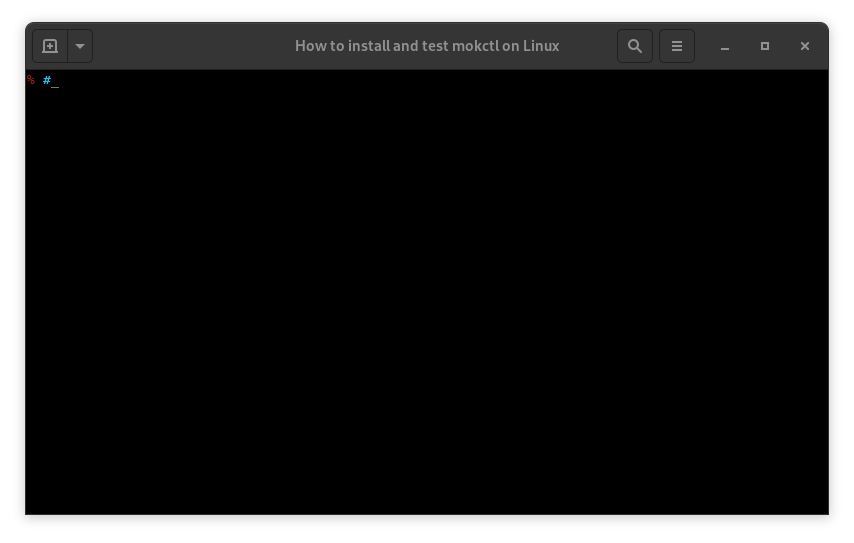

# My Own Kind



View a [Transcript of the screenscast](/cmdline-player/install-mokctl-linux.md).

## Summary

Build a verifiably conformant kubernetes cluster in containers.

## Documentation

The FAQ, Kubernetes the Hard Way using `mokctl`, integrating the Parser in your own project, and how `mokctl` was created are all in the [docs section](/docs/README.md).

### Try mokctl

Take note of the [Status](#status) below and the [Releases](https://github.com/mclarkson/my-own-kind/releases) page.

#### For Linux Operating Systems

Either [Podman](https://podman.io/) or [Docker](https://www.docker.com/get-started) must be installed frst. If both are installed `mokctl` will choose to use Podman.

If your distribution enables cgroups v2 then it must be disabled. Only Fedora do this right now, so for Fedora 31 or 32 do:

```bash
grubby --update-kernel=ALL --args="systemd.unified_cgroup_hierarchy=0"
```

To install from npm:

```bash
sudo npm install -g my-own-kind
```

Then use `mokctl`:

```bash
alias mokctl="sudo mokctl"
mokctl build image --get-prebuilt-image
mokctl create cluster myk8s --masters 1
```

Removal

```bash
sudo npm uninstall -g my-own-kind
```

#### For Non-Linux Operating Systems

Install [Docker](https://docs.docker.com/get-docker/) if you don't have it already.

Paste the following alias into your teminal:

```bash
alias mokctl='docker run --rm --privileged -ti -v /var/run/docker.sock:/var/run/docker.sock -v ~/.mok/:/root/.mok/ -e TERM=xterm-256color mclarkson/mokctl'
```

Then use mokctl:

```bash
mokctl build image --get-prebuilt-image

mokctl create cluster myk8s 1 0

export KUBECONFIG=~/.mok/admin.conf

kubectl get pods -A

kubectl run -ti --image busybox busybox sh
```

See: [Mokctl on Docker Hub](https://hub.docker.com/r/mclarkson/mokctl).

## Status

`mokctl`

* stable version - not yet.

* development version - 0.8.0-alpha2

**Mokctl Utility**

| OS        | Termnal          | Status                       |
| --------- | ---------------- | ---------------------------- |
| Fedora 31 | Gnome Terminal   | Works - must disable cgroup2 |
| Fedora 32 | Gnome Terminal   | Works - must disable cgroup2 |
| Mac OS    | Default terminal | ?                            |
| Windows   | Cygwin           | ?                            |

## Contributing

Please check the 'Help Wanted' issues if you fancy helping.

All types of contributions are welcome, from bug reports, success stories, feature requests, fixing typppos, to coding. Also check the [CONTRIBUTING.md](/CONTRIBUTING.md) document.
