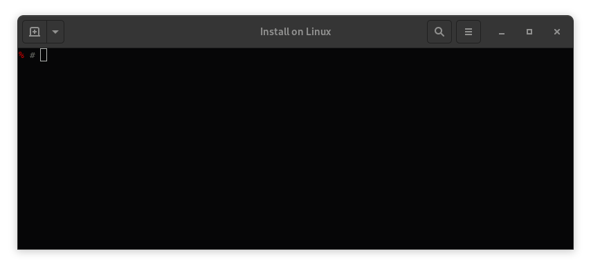

# My Own Kind



## Summary

Build a verifiably conformant kubernetes cluster in containers.

### Try mokctl

Take note of the [Status](#status) below and the [Releases](https://github.com/mclarkson/my-own-kind/releases) page.

#### For Linux Operating Systems

If your distribution enables cgroups v2 then it must be disabled - only Fedora 31/32 do this right now, so for Fedora do:

```bash
grubby --update-kernel=ALL --args="systemd.unified_cgroup_hierarchy=0"
```

To build and install from source:

```bash
git clone https://github.com/mclarkson/my-own-kind.git
cd my-own-kind
```

Install into `/usr/local/bin` (don't use mokctl if any tests fail):

```none
make test
sudo make install
```

Then use `mokctl`:

```bash
mokctl build image
mokctl create cluster myk8s 1 0
```

Removal

```bash
# To remove mokctl
sudo make uninstall

# OR, to remove mokctl and the `~/.mok/` configuration directory
sudo make purge
```

#### For Non-Linux Operating Systems

Install [Docker](https://docs.docker.com/get-docker/) if you don't have it already.

Paste the following alias into your teminal:

```bash
alias mokctl='docker run --rm --privileged -ti -v /var/run/docker.sock:/var/run/docker.sock -v ~/.mok/:/root/.mok/ -e TERM=xterm-256color mclarkson/mokctl'
```

Then use mokctl:

```bash
mokctl build image

mokctl create cluster myk8s 1 0

export KUBECONFIG=~/.mok/admin.conf

kubectl get pods -A

kubectl run -ti --image busybox busybox sh
```

See: [Mokctl on Docker Hub](https://hub.docker.com/r/mclarkson/mokctl).

See [Install Linux](/docs/install-linux.md) for more complete instructions.

## Status

**Mokctl Utility**

| OS        | Termnal          | Status                       |
| --------- | ---------------- | ---------------------------- |
| Fedora 31 | Gnome Terminal   | Works - must disable cgroup2 |
| Fedora 32 | Gnome Terminal   | Works - must disable cgroup2 |
| Mac OS    | Default terminal | ?                            |
| Windows   | Cygwin           | ?                            |

## Contributing

Please check the 'Help Wanted' issues if you fancy helping.

All types of contributions are welcome, from bug reports, success stories, feature requests, fixing typppos, to coding. Also check the [CONTRIBUTING.md](/CONTRIBUTING.md) document.
