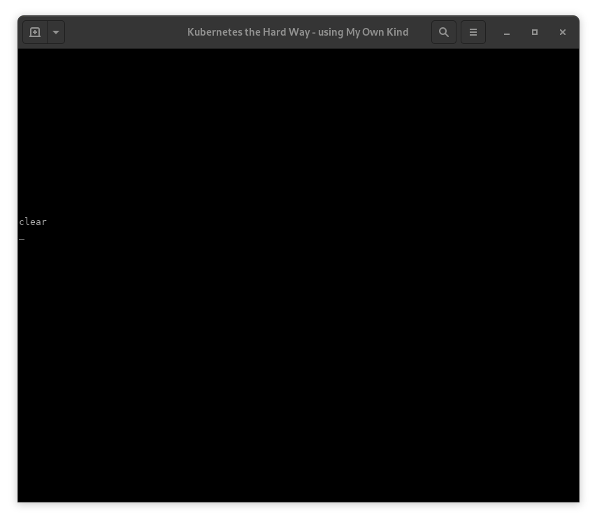

# KTHW 10 Configuring kubetcl for Remote Access



View the [screencast file](../cmdline-player/kthw-10.scr)

```bash
# ---------------------------------------------------------
# Kubernetes the Hard Way - using `mokctl` from My Own Kind
# ---------------------------------------------------------
# 10-configuring-kubectl.md
# Configure kubectl for accessing outside of the cluster

# Log into the podman container:
podman exec -ti kthw bash
# Change to the directory where the certs were copied:
cd /certs
# Create the kubeconfig file
{
  KUBERNETES_PUBLIC_ADDRESS=$(grep kthw-lb /certs/cluster-list.txt | awk '{ print $NF; }')

  kubectl config set-cluster kubernetes-the-hard-way \
    --certificate-authority=ca.pem \
    --embed-certs=true \
    --server=https://${KUBERNETES_PUBLIC_ADDRESS}:6443

  kubectl config set-credentials admin \
    --client-certificate=admin.pem \
    --client-key=admin-key.pem

  kubectl config set-context kubernetes-the-hard-way \
    --cluster=kubernetes-the-hard-way \
    --user=admin

  kubectl config use-context kubernetes-the-hard-way
}

# Verification

# Use kubectl to check cluster health:
kubectl get componentstatuses
# Looks good :)
# List nodes:
kubectl get nodes
# Great!

# --------------------------------------
# Next: Deploying the DNS Cluster Add-on
# --------------------------------------
```
