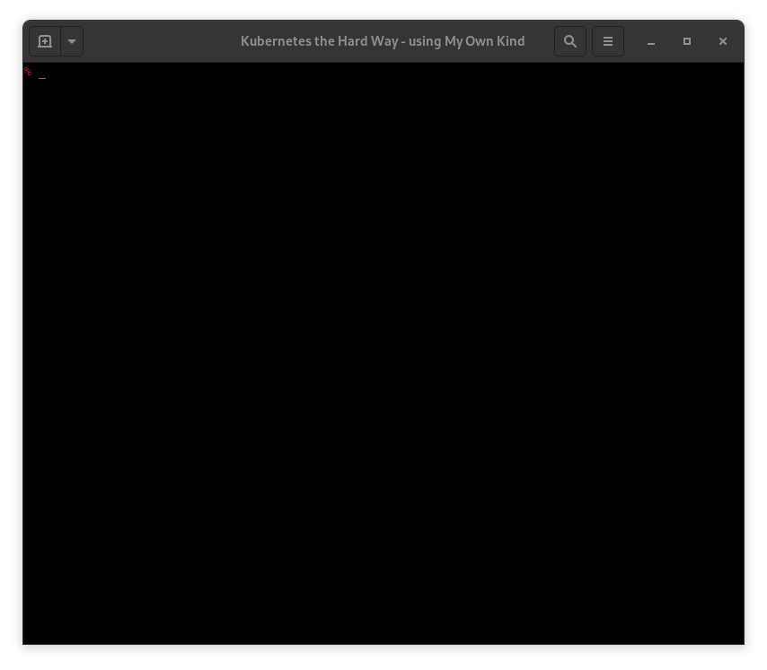

# KTHW 11 Provisioning Pod Network Routes



View the [screencast file](../cmdline-player/kthw-11.scr)

```bash
# ---------------------------------------------------------
# Kubernetes the Hard Way - using `mokctl` from My Own Kind
# ---------------------------------------------------------
# 11-pod-network-routes.md
# Provisioning Pod Network Routes

# Commands here should be run on the host - your laptop.
# Don't 'log in' to any containers.

# Set worker IP variables
{
WORKER1=$(sudo podman inspect kthw-worker-1 --format "{{.NetworkSettings.IPAddress}}")
WORKER2=$(sudo podman inspect kthw-worker-2 --format "{{.NetworkSettings.IPAddress}}")
WORKER3=$(sudo podman inspect kthw-worker-3 --format "{{.NetworkSettings.IPAddress}}")
echo $WORKER1
echo $WORKER2
echo $WORKER3
}
# create the routes
{
  sudo ip ro add 10.200.1.0/24 via $WORKER1
  sudo ip ro add 10.200.2.0/24 via $WORKER2
  sudo ip ro add 10.200.3.0/24 via $WORKER3
}
# Check the routes:
ip ro | grep 10.200
# Looks good

# All done :)

# --------------------------------------
# Next: Deploying the DNS Cluster Add-on
# --------------------------------------
```
