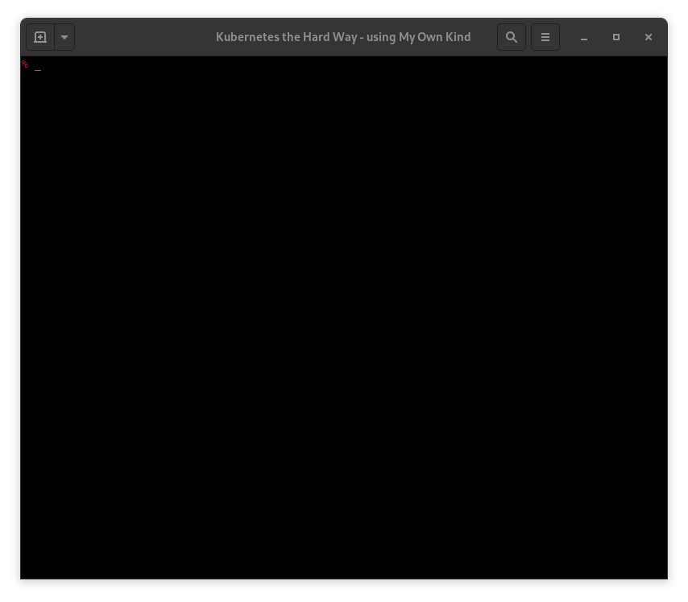

# KTHW 12 Deploying the DNS Cluster Add-on



View the [screencast file](../cmdline-player/kthw-12.scr)

```bash
# ---------------------------------------------------------
# Kubernetes the Hard Way - using `mokctl` from My Own Kind
# ---------------------------------------------------------
# 12-dns-addon.md
# Deploying the DNS Cluster Add-on

# Log into the podman container:
podman exec -ti kthw bash
# Deploy coredns:
kubectl apply -f https://storage.googleapis.com/kubernetes-the-hard-way/coredns.yaml
# Wait for coredns pods to be ready:
kubectl get pods -l k8s-app=kube-dns -n kube-system
sleep 30
kubectl get pods -l k8s-app=kube-dns -n kube-system

# Verification

# Create a busybox deployment:
kubectl run --generator=run-pod/v1 busybox --image=busybox:1.28 --command -- sleep 3600
# List the created pods:
kubectl get pods -l run=busybox
# Get its name:
POD_NAME=$(kubectl get pods -l run=busybox -o jsonpath="{.items[0].metadata.name}")
echo $POD_NAME
# Test DNS
kubectl exec -ti $POD_NAME -- nslookup kubernetes
# All looks good :)
exit

# All done :)

# ----------------
# Next: Smoke Test
# ----------------
```
