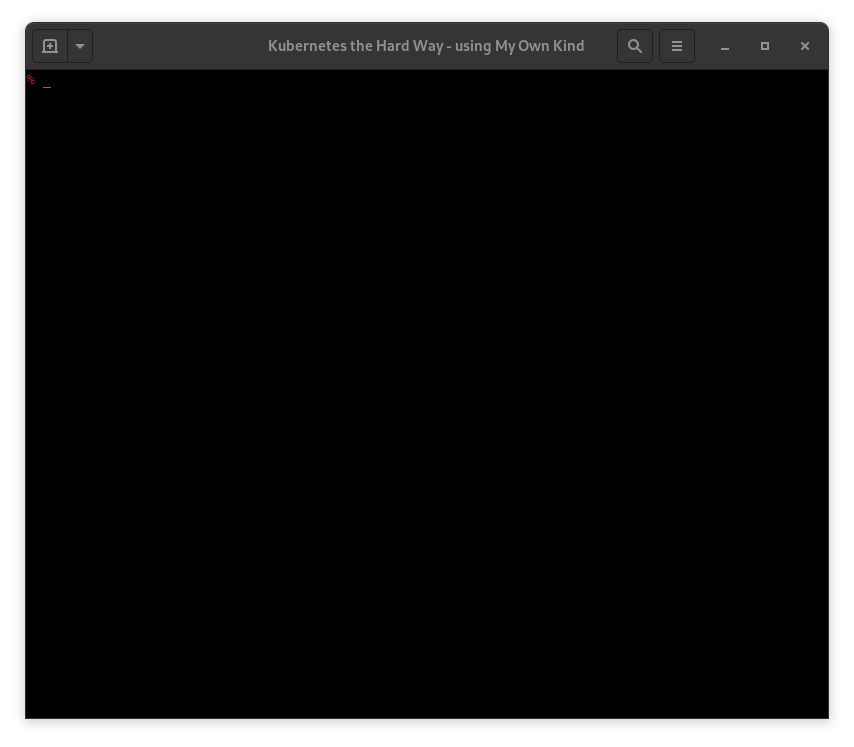

# KTHW 13 Smoke Test



View the [screencast file](../cmdline-player/kthw-13.scr)

```bash
# ---------------------------------------------------------
# Kubernetes the Hard Way - using `mokctl` from My Own Kind
# ---------------------------------------------------------
# 13-smoke-test.md
# Smoke Test

# We need to log back into the podman container, 'kthw', then
# paste the command blocks
podman exec -ti kthw bash

# Check etcd data encryption

# Create a secret that should be encrypted on disk:
kubectl create secret generic kubernetes-the-hard-way \
  --from-literal="mykey=mydata"
# Log into a master node
exit
sudo mokctl exec kthw-master-1
ETCDCTL_API=3 etcdctl get \
  --endpoints=https://127.0.0.1:2379 \
  --cacert=/etc/etcd/ca.pem \
  --cert=/etc/etcd/kubernetes.pem \
  --key=/etc/etcd/kubernetes-key.pem \
  /registry/secrets/default/kubernetes-the-hard-way | hexdump -C
# Looks pretty well mangled, good!

# Let's log back into the podman container:
exit
podman exec -ti kthw bash
# Create an nginx deployment:
kubectl create deployment nginx --image=nginx
# List the pods created by the deployment:
kubectl get pods -l app=nginx
# We'll need another terminal in a while so lets start tmux now
yum -y install tmux
tmux
tmux set status off
# Testing port forwarding
# Get the name of the nginx pod we just made:
POD_NAME=$(kubectl get pods -l app=nginx -o jsonpath="{.items[0].metadata.name}")
echo $POD_NAME
# Forward port 8080(here)->80(nginx)
kubectl port-forward $POD_NAME 8080:80
^b"
# See if the port forward works:
curl --head http://127.0.0.1:8080
# It worked!
exit
^c
# Display the nginx logs:
kubectl logs $POD_NAME
# Looks good
# Run a command in a container
kubectl exec -ti $POD_NAME -- nginx -v
# Looks good
# Expose the nginx port 80 to the node
kubectl expose deployment nginx --port 80 --type NodePort
# Get the node port that was assigned:
NODE_PORT=$(kubectl get svc nginx \
  --output=jsonpath='{range .spec.ports[0]}{.nodePort}')
echo $NODE_PORT
# Get the IP of the worker 2 'node':
EXTERNAL_IP=$(grep kthw-worker-2 /certs/cluster-list.txt | awk '{ print $NF; }')
echo $EXTERNAL_IP
# And test the exposed node port
curl -I http://${EXTERNAL_IP}:${NODE_PORT}
# It worked!
exit
exit

# All done :)

# -----------------
# Next: Cleaning Up
# -----------------
```
