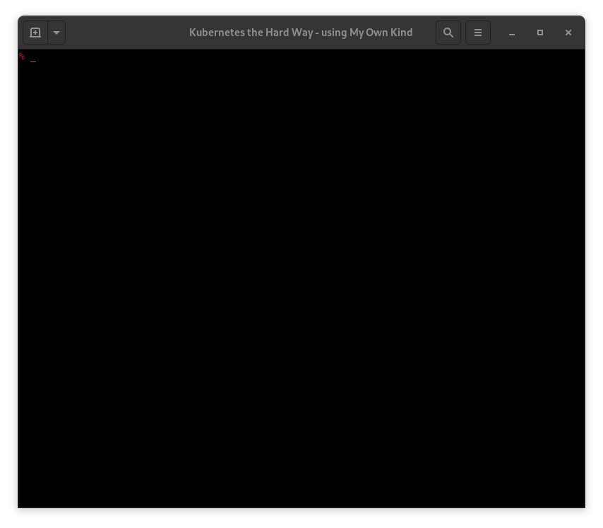

# KTHW 02 Client Tools



View the [screencast file](../cmdline-player/kthw-2.scr)

```bash
# ---------------------------------------------------------
# Kubernetes the Hard Way - using `mokctl` from My Own Kind
# ---------------------------------------------------------
# 02-client-tools
# Install CFSSL

# Let's do all this in a container so the host is kept clean
# We'll start a container with podman and create a new
# directory to use as a volume mount, where we'll put
# all the certificates.

.MD
podman ps
mkdir -p kthw-certs
podman run -d -v $PWD/kthw-certs:/certs --name kthw fedora /sbin/init
podman exec -ti kthw bash
cd
dnf -y install wget
.MD
.MD
# Installing the Client Tools
wget -q --show-progress --https-only --timestamping \
  https://storage.googleapis.com/kubernetes-the-hard-way/cfssl/linux/cfssl \
  https://storage.googleapis.com/kubernetes-the-hard-way/cfssl/linux/cfssljson
.MD
chmod +x cfssl cfssljson
.MD
sudo mv cfssl cfssljson /usr/local/bin/
.MD
.MD
.MD
# Verification
cfssl version
.MD
cfssljson --version
.MD
.MD
# Install kubectl
# Linux
.MD
wget https://storage.googleapis.com/kubernetes-release/release/v1.15.3/bin/linux/amd64/kubectl
.MD
chmod +x kubectl
.MD
sudo mv kubectl /usr/local/bin/
.MD
.MD
# Verification
kubectl version --client
.MD
.MD
exit
# ------------------------------------
# Next: Provisioning Compute Resources
# ------------------------------------
.MD
```
