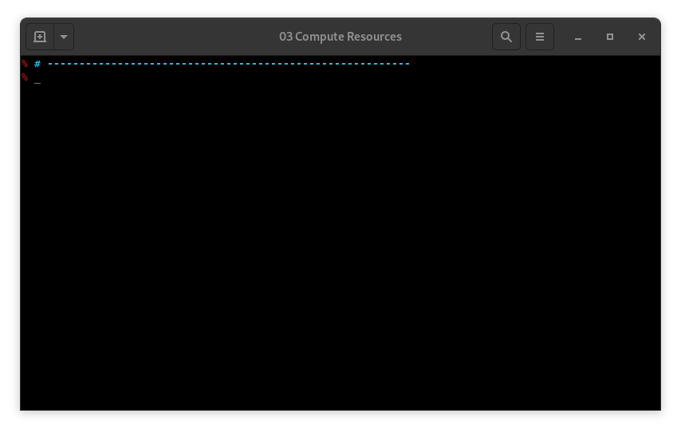

# KTHW 03 Compute Resources



View the [screencast file](../cmdline-player/kthw-3.scr)

```bash
# ---------------------------------------------------------
# Kubernetes the Hard Way - using `mokctl` from My Own Kind
# ---------------------------------------------------------
# 03-compute-resources
# Create three masters and three workers and 1 more container for haproxy

alias mokctl="sudo mokctl"
mokctl build image --get-prebuilt-image
mokctl create cluster --skipmastersetup --skiplbsetup --with-lb kthw 3 3
.MD
# List the containers
mokctl get cluster kthw
.MD
# Accessing the containers:
mokctl exec kthw-master-1
# we're in a Master!
.MD
.MD
exit
# Invoking the chooser
.MD
mokctl exec
5
# we're in a Worker!
.MD
.MD
exit
.MD
# ------------------------------------
# Next: Certificate Authority
# ------------------------------------
```
