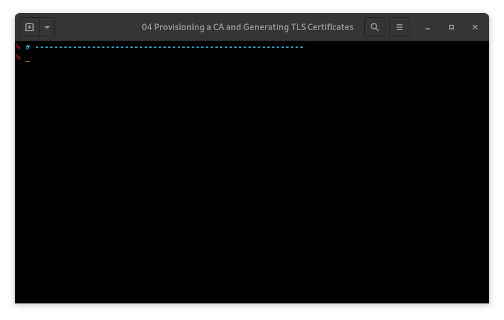

# KTHW 04 Provisioning a CA and Generating TLS Certificates



View the [screencast file](../cmdline-player/kthw-4.scr)

```bash
# ---------------------------------------------------------
# Kubernetes the Hard Way - using `mokctl` from My Own Kind
# ---------------------------------------------------------
# 04-certificate-authority
# Create all the required certificates

# We need to log back into the podman container, 'kthw' then
# paste the command blocks

podman exec -ti kthw bash

# Creating the certificate authority (CA)

cd /certs
{

cat > ca-config.json <<EOF
{
  "signing": {
    "default": {
      "expiry": "8760h"
    },
    "profiles": {
      "kubernetes": {
        "usages": ["signing", "key encipherment", "server auth", "client auth"],
        "expiry": "8760h"
      }
    }
  }
}
EOF

cat > ca-csr.json <<EOF
{
  "CN": "Kubernetes",
  "key": {
    "algo": "rsa",
    "size": 2048
  },
  "names": [
    {
      "C": "US",
      "L": "Portland",
      "O": "Kubernetes",
      "OU": "CA",
      "ST": "Oregon"
    }
  ]
}
EOF

cfssl gencert -initca ca-csr.json | cfssljson -bare ca

}
ls -lh *.pem

# Client and Server Certificates
# The Admin Client Certificate
{

cat > admin-csr.json <<EOF
{
  "CN": "admin",
  "key": {
    "algo": "rsa",
    "size": 2048
  },
  "names": [
    {
      "C": "US",
      "L": "Portland",
      "O": "system:masters",
      "OU": "Kubernetes The Hard Way",
      "ST": "Oregon"
    }
  ]
}
EOF

cfssl gencert \
  -ca=ca.pem \
  -ca-key=ca-key.pem \
  -config=ca-config.json \
  -profile=kubernetes \
  admin-csr.json | cfssljson -bare admin

}
ls -lh *.pem

# The Kubelet Client Certificates

# First we'll log out of this container, get the list of IPs from
# `mokctl` and save them in the volume mount, then log back in
# and carry on creating certs.
exit
sudo mokctl get clusters | tee kthw-certs/cluster-list.txt
podman exec -ti kthw bash
# We're back in. Is the file created?
cat /certs/cluster-list.txt
# Yes! good.
# Now to create the client certs
cd /certs
for instance in kthw-worker-1 kthw-worker-2 kthw-worker-3; do

cat > ${instance}-csr.json <<EOF
{
  "CN": "system:node:${instance}",
  "key": {
    "algo": "rsa",
    "size": 2048
  },
  "names": [
    {
      "C": "US",
      "L": "Portland",
      "O": "system:nodes",
      "OU": "Kubernetes The Hard Way",
      "ST": "Oregon"
    }
  ]
}
EOF

INTERNAL_IP=$(grep ${instance} /certs/cluster-list.txt | awk '{ print $NF; }')

cfssl gencert \
  -ca=ca.pem \
  -ca-key=ca-key.pem \
  -config=ca-config.json \
  -hostname=${instance},${INTERNAL_IP} \
  -profile=kubernetes \
  ${instance}-csr.json | cfssljson -bare ${instance}
done
ls -lh *.pem
# The Controller Manager Client Certificate

{

cat > kube-controller-manager-csr.json <<EOF
{
  "CN": "system:kube-controller-manager",
  "key": {
    "algo": "rsa",
    "size": 2048
  },
  "names": [
    {
      "C": "US",
      "L": "Portland",
      "O": "system:kube-controller-manager",
      "OU": "Kubernetes The Hard Way",
      "ST": "Oregon"
    }
  ]
}
EOF

cfssl gencert \
  -ca=ca.pem \
  -ca-key=ca-key.pem \
  -config=ca-config.json \
  -profile=kubernetes \
  kube-controller-manager-csr.json | cfssljson -bare kube-controller-manager

}
ls -lh *.pem

# The Kube Proxy Client Certificate

{

cat > kube-proxy-csr.json <<EOF
{
  "CN": "system:kube-proxy",
  "key": {
    "algo": "rsa",
    "size": 2048
  },
  "names": [
    {
      "C": "US",
      "L": "Portland",
      "O": "system:node-proxier",
      "OU": "Kubernetes The Hard Way",
      "ST": "Oregon"
    }
  ]
}
EOF

cfssl gencert \
  -ca=ca.pem \
  -ca-key=ca-key.pem \
  -config=ca-config.json \
  -profile=kubernetes \
  kube-proxy-csr.json | cfssljson -bare kube-proxy

}
ls -lh *.pem

# The Scheduler Client Certificate

{

cat > kube-scheduler-csr.json <<EOF
{
  "CN": "system:kube-scheduler",
  "key": {
    "algo": "rsa",
    "size": 2048
  },
  "names": [
    {
      "C": "US",
      "L": "Portland",
      "O": "system:kube-scheduler",
      "OU": "Kubernetes The Hard Way",
      "ST": "Oregon"
    }
  ]
}
EOF

cfssl gencert \
  -ca=ca.pem \
  -ca-key=ca-key.pem \
  -config=ca-config.json \
  -profile=kubernetes \
  kube-scheduler-csr.json | cfssljson -bare kube-scheduler

}
ls -lh *.pem

# The Kubernetes API Server Certificate

KUBERNETES_PUBLIC_ADDRESS=$(grep kthw-lb /certs/cluster-list.txt | awk '{ print $NF; }')
echo $KUBERNETES_PUBLIC_ADDRESS
MASTER1=$(grep kthw-master-1 /certs/cluster-list.txt | awk '{ print $NF; }')
echo $MASTER1
MASTER2=$(grep kthw-master-2 /certs/cluster-list.txt | awk '{ print $NF; }')
echo $MASTER2
MASTER3=$(grep kthw-master-3 /certs/cluster-list.txt | awk '{ print $NF; }')
echo $MASTER3

# Create the certificate

{

KUBERNETES_HOSTNAMES=kubernetes,kubernetes.default,kubernetes.default.svc,kubernetes.default.svc.cluster,kubernetes.svc.cluster.local

cat > kubernetes-csr.json <<EOF
{
  "CN": "kubernetes",
  "key": {
    "algo": "rsa",
    "size": 2048
  },
  "names": [
    {
      "C": "US",
      "L": "Portland",
      "O": "Kubernetes",
      "OU": "Kubernetes The Hard Way",
      "ST": "Oregon"
    }
  ]
}
EOF

cfssl gencert \
  -ca=ca.pem \
  -ca-key=ca-key.pem \
  -config=ca-config.json \
  -hostname=10.32.0.1,$MASTER1,$MASTER2,$MASTER3,${KUBERNETES_PUBLIC_ADDRESS},127.0.0.1,${KUBERNETES_HOSTNAMES} \
  -profile=kubernetes \
  kubernetes-csr.json | cfssljson -bare kubernetes

}
# Quick verification of the cert
openssl x509 -noout -in kubernetes.pem -text | grep "Subject Alt" -A 1
ls -lh *.pem
# The Service Account Key Pair

{

cat > service-account-csr.json <<EOF
{
  "CN": "service-accounts",
  "key": {
    "algo": "rsa",
    "size": 2048
  },
  "names": [
    {
      "C": "US",
      "L": "Portland",
      "O": "Kubernetes",
      "OU": "Kubernetes The Hard Way",
      "ST": "Oregon"
    }
  ]
}
EOF

cfssl gencert \
  -ca=ca.pem \
  -ca-key=ca-key.pem \
  -config=ca-config.json \
  -profile=kubernetes \
  service-account-csr.json | cfssljson -bare service-account

}
ls -lh *.pem

# Distribute the Client and Server Certificates

# We need to log out of this container then copy the certs to the
# kubernetes nodes
exit
# All the certs should be in the kthw-certs directory
ls kthw-certs
# They are, good!
# Now to copy them, workers first:
# NOTE that 'sudo' is required as these are privileged containers
# that were created with 'sudo mokctl'.
cd kthw-certs
for instance in kthw-worker-1 kthw-worker-2 kthw-worker-3; do
  sudo podman cp ca.pem ${instance}:/root
  sudo podman cp ${instance}-key.pem ${instance}:/root
  sudo podman cp ${instance}.pem ${instance}:/root
done
# Copy to the masters
for instance in kthw-master-1 kthw-master-2 kthw-master-3; do
  sudo podman cp ca.pem ${instance}:/root
  sudo podman cp ca-key.pem ${instance}:/root
  sudo podman cp kubernetes-key.pem ${instance}:/root
  sudo podman cp kubernetes.pem ${instance}:/root
  sudo podman cp service-account-key.pem ${instance}:/root
  sudo podman cp service-account.pem ${instance}:/root
done
# All done :)

# ------------------------------------------------------------------
# Next: Generating Kubernetes Configuration Files for Authentication
# ------------------------------------------------------------------
```
