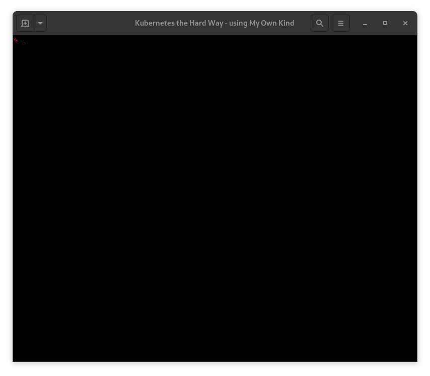

# KTHW 07 Bootstrapping the etcd Cluster



View the [screencast file](../cmdline-player/kthw-7.scr)

```bash
# ---------------------------------------------------------
# Kubernetes the Hard Way - using `mokctl` from My Own Kind
# ---------------------------------------------------------
# 07-bootstrapping-the-etcd-cluster
# Create the ETCD cluster on the master nodes.

# The cluster list needs to be copied over to get the IPs of all the nodes
# Copy to the masters
for instance in kthw-master-1 kthw-master-2 kthw-master-3; do
  sudo podman cp kthw-certs/cluster-list.txt ${instance}:/root/
done

# We will use 'tmux' to log in to three containers and then
# execute the commands in parallel.

tmux
tmux set status off
tmux split
tmux split
tmux select-layout even-vertical
^aj
sudo mokctl exec kthw-master-1
^aj
sudo mokctl exec kthw-master-2
^aj
sudo mokctl exec kthw-master-3
# syncing screens
^a^x
# Panes are now synced!
# Clearing the screen
clear
# Install wget
yum -y install wget
# Download and Install the etcd Binaries
cd
wget "https://github.com/etcd-io/etcd/releases/download/v3.4.0/etcd-v3.4.0-linux-amd64.tar.gz"
# Extract and install
{
  tar -xvf etcd-v3.4.0-linux-amd64.tar.gz 2>/dev/null
  mv etcd-v3.4.0-linux-amd64/etcd* /usr/local/bin/
}

# Configure the etcd server
{
  mkdir -p /etc/etcd /var/lib/etcd
  cp ca.pem kubernetes-key.pem kubernetes.pem /etc/etcd/
}

# Get the 'instance internal IP address', which for us is the host's IP address
INTERNAL_IP=$(ip ro get default 8.8.8.8 | head -n 1 | cut -f 7 -d " ")
echo $INTERNAL_IP
IP_MASTER_1=$(grep kthw-master-1 /root/cluster-list.txt | awk '{ print $NF; }')
echo $IP_MASTER_1
IP_MASTER_2=$(grep kthw-master-2 /root/cluster-list.txt | awk '{ print $NF; }')
echo $IP_MASTER_2
IP_MASTER_3=$(grep kthw-master-3 /root/cluster-list.txt | awk '{ print $NF; }')
echo $IP_MASTER_3
ETCD_NAME=$(hostname -s)
# Write the etcd systemd unit file
cat <<EOF | tee /etc/systemd/system/etcd.service
[Unit]
Description=etcd
Documentation=https://github.com/coreos

[Service]
Type=notify
ExecStart=/usr/local/bin/etcd \\
  --name ${ETCD_NAME} \\
  --cert-file=/etc/etcd/kubernetes.pem \\
  --key-file=/etc/etcd/kubernetes-key.pem \\
  --peer-cert-file=/etc/etcd/kubernetes.pem \\
  --peer-key-file=/etc/etcd/kubernetes-key.pem \\
  --trusted-ca-file=/etc/etcd/ca.pem \\
  --peer-trusted-ca-file=/etc/etcd/ca.pem \\
  --peer-client-cert-auth \\
  --client-cert-auth \\
  --initial-advertise-peer-urls https://${INTERNAL_IP}:2380 \\
  --listen-peer-urls https://${INTERNAL_IP}:2380 \\
  --listen-client-urls https://${INTERNAL_IP}:2379,https://127.0.0.1:2379 \\
  --advertise-client-urls https://${INTERNAL_IP}:2379 \\
  --initial-cluster-token etcd-cluster-0 \\
  --initial-cluster kthw-master-1=https://$IP_MASTER_1:2380,kthw-master-2=https://$IP_MASTER_2:2380,kthw-master-3=https://$IP_MASTER_3:2380 \\
  --initial-cluster-state new \\
  --data-dir=/var/lib/etcd
Restart=on-failure
RestartSec=5

[Install]
WantedBy=multi-user.target
EOF

# Start the etcd Server
{
  systemctl daemon-reload
  systemctl enable etcd
  systemctl start etcd
}

# Verification
ETCDCTL_API=3 etcdctl member list \
  --endpoints=https://127.0.0.1:2379 \
  --cacert=/etc/etcd/ca.pem \
  --cert=/etc/etcd/kubernetes.pem \
  --key=/etc/etcd/kubernetes-key.pem
# It works!
# All done :)

# ------------------------------------------------
# Next: Bootstrapping the Kubernetes Control Plane
# ------------------------------------------------
```
