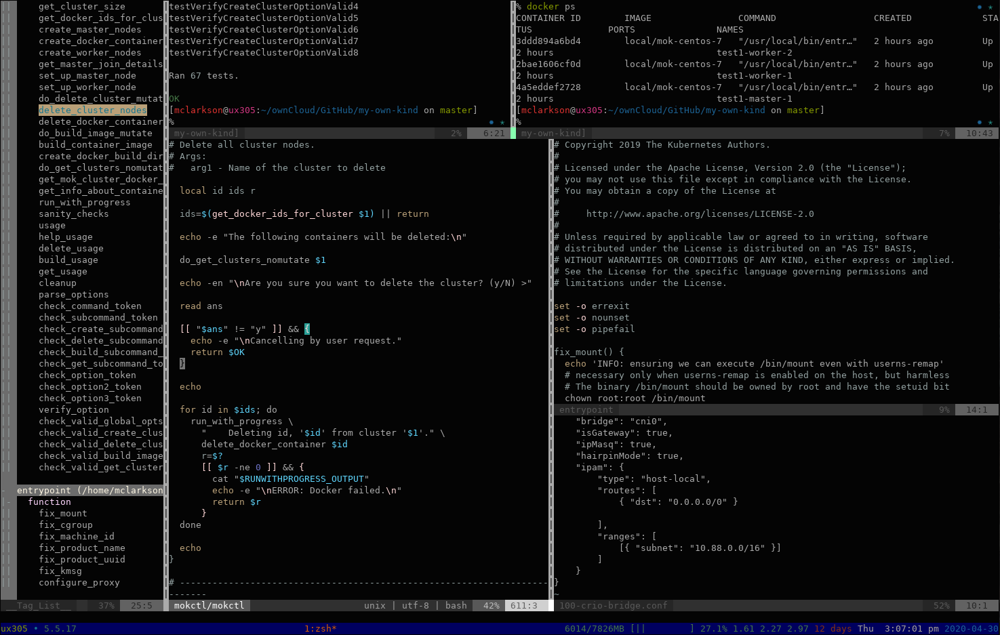

# My Dev Env

About my development environment. I use [Vim](https://www.vim.org) on [Fedora]( https://getfedora.org/) Linux and here's what my development window looks like:

 

 In the left pane I have the Taglist vim plugin, which shows all the shell functions, which is invaluable when there are a lot of functions in a single file. Taglist gets that information from ‘tags’ produced by `ctags`, which you can see in the Makefile.

 The top two panes are a couple of linux terminals. Code files are in the other three panes.

 The status bar at the bottom is created by `tmux`, so I'm running Vim inside Tmux. I wrote a small [Blog post about Tmux](http://blogger.smorg.co.uk/2020/04/tmux-for-gnu-screen-users-on-linux.html).

 There's a steep learning curve to go through when first starting out with Vim, and most people don't realise the power of it, thinking it's just for editing bits of text, but it's well worth learning as it's on just about every server I've worked on (or at least `vi` is, which is the original. `vim` is Vi iMproved), and will give you enough problems installing things to improve your Linux skills!

 Vim is for touch-typists. Learn touch typing to get the full benefit! See: klavaro - I got 66.91 word per minute the other day, gtypist, pencil and typespeed - Linux touch typing tools and tutors.

 This setup keeps everything in one window and my hands mostly on the keyboard. I also have quite a few `vim` plugins installed, but I won't spoil your fun finding what's best for you by telling you - although CtrlP and Ack are great productivity enhancers.
