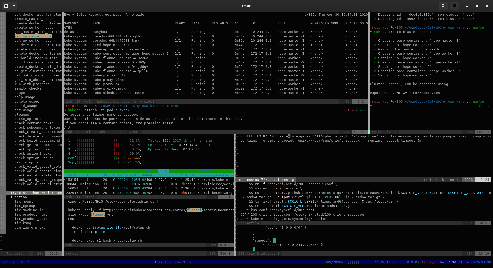

# Testing and Fixing

<!-- START doctoc generated TOC please keep comment here to allow auto update -->

<!-- DON'T EDIT THIS SECTION, INSTEAD RE-RUN doctoc TO UPDATE -->

<!-- DON'T EDIT THIS SECTION, INSTEAD RE-RUN doctoc TO UPDATE -->

- [Fixing Busybox not working](#fixing-busybox-not-working)
  - [Trying the changes](#trying-the-changes)
  - [Result](#result)
  - [Summary](#summary)
  - [All working at last!](#all-working-at-last)
- [Checking against Kind](#checking-against-kind)
  - [Finding the root cause](#finding-the-root-cause)
    - [Comparing Components](#comparing-components)
    - [Comparing Logs](#comparing-logs)
    - [Code Tidy Ups](#code-tidy-ups)
    - [Niggles (skip this - in progress)](#niggles-skip-this---in-progress)
  - [Checking Networking](#checking-networking)
    - [Pod Networking](#pod-networking)
    - [DNS](#dns)
- [Summary](#summary-1)
- [What's next](#whats-next)

<!-- END doctoc generated TOC please keep comment here to allow auto update -->

Previously I showed to different ways to ‘join’ a node to the cluster. I placed the second version, from the ‘Build’ lab, in the mokctl code and spent a couple hours trying to get it working. It wouldn't, work, so I went back to the first, phased, version and it worked straight away. I'm not sure why yet but we'll return to that later.

We have the new utility program, `mokctl`,  which builds new master and worker ‘nodes’. All the system pods start but a simple busybox pod does not. Not working:

```bash
kubectl run -ti --image busybox busybox sh
```

## Fixing Busybox not working

On CRI-O’s GitHub repository there is a page [Running CRI-O with kubeadm tutorial](https://github.com/cri-o/cri-o/blob/master/tutorials/kubeadm.md) provides some important information that I will check:

* In the `entrypoint` file, taken from Kind, there is a function, `fix_cgroup` that remaps cgroups by moving files and directories around in the `/sys/fs/cgroup` pseudo-filesystem. I copied bits of code from that and pasted directly into my system and found that this code is never run for us, so it seems that is for fixing old versions of docker. I'm not sure if this is relevant or not yet, but think not, as it's trying to recreate the original cgroup layout. Our cgroups look the same inside and outside of a container hence why I think this is not our problem.

* `/var/lib/kubelet/kubeadm-flags.env` should be: 
  
  ```none
  KUBELET_EXTRA_ARGS=--feature-gates="AllAlpha=false,RunAsGroup=true" --container-runtime=remote --cgroup-driver=systemd --container-runtime-endpoint=&#39;unix:///var/run/crio/crio.sock&#39; --runtime-request-timeout=5m
  ```

* The cri-o CNI in, `/etc/cni/net.d/100-crio-bridge.conf`, should have:
  
      ...
        "ranges": [
            [{ "subnet": "10.244.0.0/16" }]
        ]
      ...

* `/etc/crio/crio.conf` try:
  
      ...
      # Cgroup management implementation used for the runtime.
      cgroup_manager = "systemd"
      ...
  
  The ‘cgroup_manager’ setting here should match ‘--cgroup-driver’ in the `/var/lib/kubelet/kubeadm-flags.env` file above.

* There's some documentation in [kuberenetes.io/docs](https://kubernetes.io/docs/setup/production-environment/container-runtimes/#cri-o) that tells us how to install cri-o, but I get a 404, file not found, error when I try it, so we're probably doing it the right way, with:
  
        # The crio docs tell us that this is the way to do it
      
        CRIO_VERSION=1.17 # <- for kubernetes 1.17 - crio 1.18 is not available yet
        curl -L -o /etc/yum.repos.d/devel:kubic:libcontainers:stable.repo https://download.opensuse.org/repositories/devel:kubic:libcontainers:stable/CentOS_7/devel:kubic:libcontainers:stable.repo
        curl -L -o /etc/yum.repos.d/devel:kubic:libcontainers:stable:cri-o:$CRIO_VERSION.repo https://download.opensuse.org/repositories/devel:kubic:libcontainers:stable:cri-o:$CRIO_VERSION/CentOS_7/devel:kubic:libcontainers:stable:cri-o:$CRIO_VERSION.repo
      
        # Kubernetes needs the traffic control binary, tc.
        # You'll see an error in kubeadm later if 'tc' is not installed.
        yum -y install cri-o ...
  
  Which gets crio from downloads.opensuse.org. That's what cri-o said to do for RHEL/CentOS systems.
  
  ### Checking our system
  
  After building a kubernetes cluster with,
  
  ```bash
  mokctl create cluster badclust 1 2
  ```
  
  , I had a look at the system and it doesn't match the above. I made changes by hand by using `docker exec -ti badclust-worker-1` to enter into the worker container and made the above changes.
  
  I only changed one worker and left the other one. After the changes the Kubelet  on the edited worker consumed a great deal less CPU than the other non-edited worker. That was too easy! Let's code in those changes and see if it works.
  
  ### Changing the code
  
  #### entrypoint
  
  No need to touch.
  
  #### /var/lib/kubelet/kubeadm-flags.env
  
  I think Kubeadm creates this. Set up a single node cluster with `mokctl create cluster --skipmastersetup test 1 0` and exec in with `docker exec -ti test-master-1 bash`. 
  
  `rpm -qa | grep kube` shows all necessary kubernetes binaries installed, but the directory `/var/lib/kubelet does` not exist. Maybe Kubeadm writes it?
  
  From [Configuring each kubelet in your cluster using kubeadm - Kubernetes](https://v1-16.docs.kubernetes.io/docs/setup/production-environment/tools/kubeadm/kubelet-integration/#the-kubelet-drop-in-file-for-systemd):
  
  > ## The kubelet drop-in file for systemd
  > 
  > kubeadm ships with configuration for how systemd should run the kubelet.
  > Note that the kubeadm CLI command never touches this drop-in file.
  > 
  > This configuration file installed by the `kubeadm` [DEB](https://github.com/kubernetes/kubernetes/blob/master/build/debs/10-kubeadm.conf) or [RPM package](https://github.com/kubernetes/kubernetes/blob/master/build/rpms/10-kubeadm.conf) is written to `/etc/systemd/system/kubelet.service.d/10-kubeadm.conf` and is used by systemd.
  > It augments the basic [`kubelet.service` for RPM](https://github.com/kubernetes/kubernetes/blob/master/build/rpms/kubelet.service) (resp. [`kubelet.service` for DEB](https://github.com/kubernetes/kubernetes/blob/master/build/debs/kubelet.service))):
  > 
  > ```none
  > [Service]
  > Environment="KUBELET_KUBECONFIG_ARGS=--bootstrap-kubeconfig=/etc/kubernetes/bootstrap-kubelet.conf
  > --kubeconfig=/etc/kubernetes/kubelet.conf"
  > Environment="KUBELET_CONFIG_ARGS=--config=/var/lib/kubelet/config.yaml"
  > # This is a file that "kubeadm init" and "kubeadm join" generate at runtime, populating
  > the KUBELET_KUBEADM_ARGS variable dynamically
  > EnvironmentFile=-/var/lib/kubelet/kubeadm-flags.env
  > # This is a file that the user can use for overrides of the kubelet args as a last resort. Preferably,
  > #the user should use the .NodeRegistration.KubeletExtraArgs object in the configuration files instead.
  > # KUBELET_EXTRA_ARGS should be sourced from this file.
  > EnvironmentFile=-/etc/default/kubelet
  > ExecStart=
  > ExecStart=/usr/bin/kubelet $KUBELET_KUBECONFIG_ARGS $KUBELET_CONFIG_ARGS $KUBELET_KUBEADM_ARGS $KUBELET_EXTRA_ARGS
  > ```
  > 
  > This file specifies the default locations for all of the files managed by kubeadm for the kubelet.
  > 
  > - The KubeConfig file to use for the TLS Bootstrap is `/etc/kubernetes/bootstrap-kubelet.conf`,
  >   but it is only used if `/etc/kubernetes/kubelet.conf` does not exist.
  > - The KubeConfig file with the unique kubelet identity is `/etc/kubernetes/kubelet.conf`.
  > - The file containing the kubelet’s ComponentConfig is `/var/lib/kubelet/config.yaml`.
  > - The dynamic environment file that contains `KUBELET_KUBEADM_ARGS` is sourced from `/var/lib/kubelet/kubeadm-flags.env`.
  > - **The file that can contain user-specified flag overrides with `KUBELET_EXTRA_ARGS` is sourced from `/etc/default/kubelet` (for DEBs), or `/etc/sysconfig/kubelet` (for RPMs). `KUBELET_EXTRA_ARGS` is last in the flag chain and has the highest priority in the event of conflicting settings.**
  
  The last bullet point shows where we should add that line. We're using CentOS (RPMs) so it's `/etc/sysconfig/kubelet`, and indeed, the file is there continaining just `KUBELET_EXTRA_ARGS=`.
  
  If we add that file it will be overwritten by `yum whatprovides /etc/sysconfig/kubelet`, which is the `kubelet-<version>` rpm. So we need to change that file in the Dockerfile or `mokctl`, in the function, ‘set_up_master_node()’ and ‘set_up_worker_node()’.
  
  I added the new config to the Dockerfile using COPY, and added the two files to the mok-centos-7 directory. 
  
  #### /etc/cni/net.d/100-crio-bridge.conf
  
  `yum whatprovides /etc/cni/net.d/100-crio-bridge.conf` is written when cri-o is installed. I edited the file, '100-crio-bridge.conf' that is already in the `mok-centos-7` directory.
  
  #### /etc/crio/crio.conf
  
  Doing `grep cgroup_manager /etc/crio/crio.conf` produces: `group_manager = "cgroupfs"`. So this also needs changing. This was already changed in the Dockerfile to ’cgroupfs’, as I thought it was the correct setting. I will change it to ‘systemd’.

### Trying the changes

```bash
  # Let's delete that test cluster
  mokctl delete cluster test

  # We made changes to dockerfile so rebuild the docker image
  # First update mokctl with the new dockerfiles
  # `cd` into the top level my-own-kind directory then
  sudo make install

  # Then rebuild the image (it will take a few minutes)
  mokctl build image

  # A four node cluster made my laptop unhappy last time so
  # lets try that again
  mokctl create cluster hope 1 3
```

### Result

* I had not deleted the cluster and the Kubelet timed out waiting for the Kube-apiserver to start.

* Deleted all clusters

* Trying again

* It still didn't work

* I tested cri-o using [Test cri-o](/docs/build.md#test-cri-o) - that worked so crio is ok.

* `/etc/sysconfig/kubelet` has our changes, but they are not in `/var/lib/kubelet/kubeadm-flags.env`, however `ps` shows:
  
      [root@hope-master-1 /]# ps axwwww | grep kubelet
         2173 ?        Ssl    0:00 /usr/bin/kubelet --bootstrap-kubeconfig=/etc/kubernetes/bootstrap-kubelet.conf --kubeconfig=/etc/kubernetes/kubelet.conf --config=/var/lib/kubelet/config.yaml --container-runtime=remote --container-runtime-endpoint=/var/run/crio/crio.sock --feature-gates=AllAlpha=false,RunAsGroup=true --container-runtime=remote --cgroup-driver=systemd --container-runtime-endpoint=unix:///var/run/crio/crio.sock --runtime-request-timeout=5m
  
  which is correct. Trying without the 'unix:///' prefix. (edit file then restart kubelet)
  
  It told me the format I'm using is deprecated so changing back.

* Tried removing the Alpha settings. No change

* Changed `/etc/sysconfig/kubelet` and `/etc/crio/crio.conf` to use cgroupfs

* Worked!

* Putting alpha bits back

* Still works

So, I've changed those two settings in the Dockerfiles and rebuilt the docker image again. Now to try that four node cluster.

It works and I can still use my laptop without noticing any slow-down, unlike the last time.

Now to try the busybox container:

```bash
kubectl run -ti --image busybox busybox sh
```

It failed again. Saying: `... failed to get network JSON for pod sandbox ...`

```bash
vi /etc/cni/net.d/10* -o
# change both files to version 0.3.1
```

Worked. I'm not sure what to do here because it's the flannel version that needs changing to 0.3.1 in the 10-flannel.conflist file.

Checking versions I see that I'm installing flannel as per the kubernetes docs and [those instructions have been removed](https://github.com/kubernetes/website/commit/f73647531dcdade2327412253a5f839781d57897/)

CoreOS, who wrote Flannel, say, for Kubernetes V1.17+ to use:

```bash
kubectl apply -f https://raw.githubusercontent.com/coreos/flannel/master/Documentation/kube-flannel.yml
```

For, MOK this is run in `set_up_master_nodes` in `mokctl`. Changing and retrying... No need to rebuild the image this time.

### Summary

1. Trying systemd earlier on the worker, but this time it didn't so I changed it back.
   
   I'm going to read the [cgroups(7) - Linux manual page](http://man7.org/linux/man-pages/man7/cgroups.7.html) again and the ‘fix_cgroup’ function comments in Kind's [entrypoint](/mok-centos-7/entrypoint) file.

2. The incorrect Flannel version was installed.

### All working at last!

Running busybox worked first time. My system is OK..ish. The following screenshot says alot:



For information about my development environment see: [devenv.md](/docs/devenv.md).

## Checking against Kind

The CPU usage still seems quite high and I'm not sure if we will get 3 masters, 3 workers, and a load-balancer running. That would allow me to do a full Kubernetes-the-hard-way. Let's compare CPU usage to Kind.

kind 4-node cluster uses around 20% CPU

mok 4-node cluster uses around 50% CPU

Not good. It still needs fixing...

### Finding the root cause

We've got away with not digging too deep up to now but we will need to put a little more effort in to find the root cause.

#### Comparing Components

Kind: Ubuntu 19 nodes, containerd, kind-net, k8s version 1.17.0

Mok: Centos 7 nodes, cri-o, flannel, k8s version 1.18.2

#### Comparing Logs

View logs on master and worker using `journalctl -xef`

Kind - Logs stop once kind finishes

Mok - Logs continue with errors

Mok - Lots of errors like:

> May 01 11\:41:17 myclust-master-1 kubelet[881]: W0501 11\:41:17.258878     881 kubelet_getters.go:297] Path "/var/lib/kubelet/pods/99bb6bcb-7fed-4c59-8158-8566cfbe0df0/volumes" does not exist

So is this something to do with the storage driver?

First lets check if kind uses the same settings listed at the top of this page. Checking...

It mostly does.

After reading [cgroups(7) - Linux manual page](http://man7.org/linux/man-pages/man7/cgroups.7.html) and the fix_cgroup function comments in [entrypoint](/mok-centos-7/entrypoint), and an earlier observation that `/sys/fs/cgroups` in our container is just like the host's `/sys/fs/cgroup`, I checked Kind and it has much less in it's cgroup filesystem.

In the comment the Kind authors say that Docker remaps the cgroup hierarchy which confuses kubelet and cri-o due to `/proc/$PID/cgroup` not matching `/sys/fs/cgroup`. The source of this information is on [this systemd documentation page](https://systemd.io/CONTAINER_INTERFACE/) - see point 6.

The Kind fix does not remap any cgroups because in our case Docker does not remap the cgroups either. So, I added the following function to the `entrypoint` file:

```bash
centos7_fix_cgroup() {
  local a
  echo 'INFO: fix cgroup mounts for centos7'
  local id=$(awk -F/ '{ print $NF; exit }' /proc/1/cgroup)
  echo "docker id = $id"
  find /sys/fs/cgroup -name "$id" | while read a ; do mount --bind $a ${a%/*/*}; done
}

...

# run pre-init fixups
fix_kmsg
fix_mount
centos7_fix_cgroup     # <-- added before Kind's fix_cgroup
fix_cgroup
fix_machine_id
fix_product_name
fix_product_uuid
configure_proxy

```

The `centos7_fix_cgroup` function first gets the cgroup that `/sbin/init` is in - `init` is always PID 1 and the numbers in the root of `/proc` relate to process IDs. It then looks for those IDs in the cgroups pseudo-filesystem and mounts them in the places that the original code expects to find them. The original code, `fix_cgroup` runs and does it's thing copying them back.

The commit for this fix is [Fix performance issue · mclarkson/my-own-kind@b8676e3 · GitHub](https://github.com/mclarkson/my-own-kind/commit/b8676e36ae255ad7d5ba4dd55d5bee039b1ea542). To view the output created by `entrypoint` use `docker logs <container id>`.

I kept the cgroup driver set to systemd, as this produced the lowest CPU in the first tests at the top of this page and rebuilt the image and built a four node cluster.

It's now using about the same CPU as Kind, that's less than 30%! Great!

Trying a seven node cluster, as that was the goal, so that's 1 master and 6 workers...

... and? Once the system had fully started up it was using under 30% cpu and load was low, but three worker nodes stayed in an Error state. Stopping the nodes and manually starting them worked and I noticed I hadn't enabled the kubelet with `systemctl enable kubelet`. I added the command to `setup_master()` and `setup_worker` (I had taken it out of the Dockerfile because it stopped the set up code working) and tried again, and it still didn't work.

It would be nice to also be able to `mokctl edit cluster myclust add worker 1` to test adding nodes slowly. I've added this to the ‘Help Wanted’ Project in this repository, but I'm happy with this right now.

#### Code Tidy Ups

I put a note on a couple of groups on Reddit about `mokctl` and got some good feedback about the code. Some of it highlighted that I needed a linter and code formatter so I added that to our Makefile - look for `shellcheck` and `shfmt` and see [CONTRIBUTING.md](/CONTRIBUTING.md). The recommended changes were useful, some I had done already, but I'll list them next:

* Only use UPPERCASE for globals.
  
  I always stick to this in shell scripts.

* Don't use backticks, '`', for running commands, use '$(' instead.
  
  `shellcheck` catches these.

* 'declare -r' is not portable, use 'readonly' instead.

* 'echo' is not portable, use 'printf' instead.

* Use heredocs instead of multiple 'echo' lines.


#### Niggles (skip this - in progress)

I tried using cgroupfs and systemd as options to kubelet and crio. Some times cgroupfs worked and sometimes systemd worked.

The easiest thing would be for systemd or docker to create new cgroup hierarchies and mount them into the container as root. However, doing that breaks the '/proc/PID/cgroup' mapping. So instead, whatever starts the container needs to bind mount over the root cgroups with the cgroup it's in itself. This way the structure is the same, keeping '/proc/PID/cgroup'  happy, and container tools that use '/sys/fs/cgroup' are also happy, because they don't see container ID's that they now nothing about.

This can be tested. First see what a `systemd-nspawn` container looks like (might need to use febootstrap, which is the Fedora version of debootstrap, to get a small chroot system), then try using nsenter, and the same "chroot" files, and bind mounts to set it up. Then try to run kubelet and crio in it. So forget febootstrap and copy the linux container files out so it's easy to test crio and kubelet - will have to run the binaries directly without systemctl. <mark>Break this out</mark>

A Systemd author said to either use systemd to run the container, or use some really tricky api over DBUS protocol, probably requiring a language that has glib and dbus bindings. You'll find that in the block of links above.

### Checking Networking

#### Pod Networking

For multi-node clusters CRI-O is configured incorrectly. Sometimes IP ranges overlap on each node. When CRI-O is needed to run on multiple nodes the configuration needs to be mostly empty, leaving the network set up to a CNI. See: [cri-o/kubernetes.md at master · cri-o/cri-o · GitHub](https://github.com/cri-o/cri-o/blob/master/tutorials/kubernetes.md), where we are given:

```none
# cat /etc/cni/net.d/10-crio.conf
{
    "name": "crio",
    "type": "flannel"
}
```

Without the above, kubernetes will complain - but will seem to work, until multiple Pods are started.

It also says:

> You need to add following parameters to `KUBELET_ARGS`:
> 
> - `--container-runtime=remote` - Use remote runtime with provided socket.
> - `--container-runtime-endpoint=unix:///var/run/crio/crio.sock` - Socket for remote runtime (default `crio` socket localization).
> - `--runtime-request-timeout=10m` - Optional but useful. 
>   Some requests, especially pulling huge images, may take longer than 
>   default (2 minutes) and will cause an error.

We did the first two, but not the last, `--runtime-request-timeout=10m`. This probably should be added. We are also given:

```none
KUBELET_EXTRA_ARGS=--feature-gates="AllAlpha=false,RunAsGroup=true" --container-runtime=remote --cgroup-driver=systemd --container-runtime-endpoint='unix:///var/run/crio/crio.sock' --runtime-request-timeout=5m
```

#### DNS

Using Flannel and CRI-O as in the previous section, DNS does not work.

The coredns pods have IP addresses, 10.244.0.2 and 10.244.0.3.

The `/etc/resolv.conf` settings on new pods point DNS to 10.96.0.10.

These settings are not in the coredns yaml file, and if coredns is scaled to 0 then back to 2 (a restart), then the new pods don't start, with:

```none
Readiness probe failed: HTTP probe failed with statuscode: 503
```

and pod logs containing:

```none
Get https://10.96.0.1:443/api/v1/namespaces?limit=500&resourceVersion=0:
 dial tcp 10.96.0.1:443: i/o timeout
```

So, coredns uses default settings for itself, and for the location of the API server.

Looking up in kubernetes official docs: [Customizing DNS Service - Kubernetes](https://kubernetes.io/docs/tasks/administer-cluster/dns-custom-nameservers/), it tells us:

> ... The kubelet passes DNS to each container with the `--cluster-dns=<dns-service-ip>` flag. ...
> 
> DNS names also need domains. You configure the local domain in the kubelet
> with the flag `--cluster-domain=<default-local-domain>`.

From: [Customizing control plane configuration with kubeadm - Kubernetes](https://kubernetes.io/docs/setup/production-environment/tools/kubeadm/control-plane-flags/), the kubeadm default values can be seen using `kubeadm config print init-defaults`:

```yaml
apiVersion: kubeadm.k8s.io/v1beta2
bootstrapTokens:
- groups:
  - system:bootstrappers:kubeadm:default-node-token
  token: abcdef.0123456789abcdef
  ttl: 24h0m0s
  usages:
  - signing
  - authentication
kind: InitConfiguration
localAPIEndpoint:
  advertiseAddress: 1.2.3.4
  bindPort: 6443
nodeRegistration:
  criSocket: /var/run/dockershim.sock
  name: myk8s-master-1
  taints:
  - effect: NoSchedule
    key: node-role.kubernetes.io/master
---
apiServer:
  timeoutForControlPlane: 4m0s
apiVersion: kubeadm.k8s.io/v1beta2
certificatesDir: /etc/kubernetes/pki
clusterName: kubernetes
controllerManager: {}
dns:
  type: CoreDNS
etcd:
  local:
    dataDir: /var/lib/etcd
imageRepository: k8s.gcr.io
kind: ClusterConfiguration
kubernetesVersion: v1.18.0
networking:
  dnsDomain: cluster.local
  serviceSubnet: 10.96.0.0/12
scheduler: {}
```

We need to edit the above and run `kubeadm init` with `--config <YOUR CONFIG YAML>`.

The following resources are needed to work out how to write a kubeadm configuration file:

* [kubeadm init - Kubernetes](https://kubernetes.io/docs/reference/setup-tools/kubeadm/kubeadm-init/)

* kubeadm config: [v1beta2 - GoDoc](https://godoc.org/k8s.io/kubernetes/cmd/kubeadm/app/apis/kubeadm/v1beta2)

* kubelet config: [v1beta1 - GoDoc](https://godoc.org/k8s.io/kubelet/config/v1beta1#KubeletConfiguration) or [kubernetes/types.go at release-1.18](https://github.com/kubernetes/kubernetes/blob/release-1.18/staging/src/k8s.io/kubelet/config/v1beta1/types.go)

Now using the kubeadm allows me to get rid of the 'hack' used in the Build and Package sections - so no Phases are needed. The new kubeadm config and `kubeadm init` command line can be seen in the `set_up_master_node_v1_18_2` function:

```bash
apiVersion: kubeadm.k8s.io/v1beta2
kind: InitConfiguration
bootstrapTokens:
- groups:
  - system:bootstrappers:kubeadm:default-node-token
  token: abcdef.0123456789abcdef
  ttl: 24h0m0s
  usages:
  - signing
  - authentication
localAPIEndpoint:
  advertiseAddress: $ipaddr
  bindPort: 6443
nodeRegistration:
  criSocket: /var/run/crio/crio.sock
  name: myk8s-master-1
  kubeletExtraArgs: {}
  taints:
  - effect: NoSchedule
    key: node-role.kubernetes.io/master
---
apiVersion: kubelet.config.k8s.io/v1beta1
kind: KubeletConfiguration
failSwapOn: false
featureGates:
  AllAlpha: false
  RunAsGroup: true
runtimeRequestTimeout: "5m"
---
kind: ClusterConfiguration
apiServer:
  timeoutForControlPlane: 4m0s
apiVersion: kubeadm.k8s.io/v1beta2
certificatesDir: /etc/kubernetes/pki
clusterName: kubernetes
controllerManager: {}
dns:
  type: CoreDNS
etcd:
  local:
    dataDir: /var/lib/etcd
imageRepository: k8s.gcr.io
kubernetesVersion: v1.18.2
networking:
  dnsDomain: cluster.local
  podSubnet: 10.244.0.0/16
  serviceSubnet: $hostnet
scheduler: {}
```

And finally, the kubernetes pods were unable to lookup names using DNS. Flannel logs showed that it didn't have enough rights to set IP tables masquerade for node to external DNS. I changed 'privileged: false' to true in the flannel daemonsets, and then setting iptables worked. I'm not yet sure why NETADMIN rights wasn't enough for this. 

## Summary

So the answers were all to be found in official documentation:

CRI

- [Running CRI-O with kubeadm tutorial](https://github.com/cri-o/cri-o/blob/master/tutorials/kubeadm.md)

- [Configuring each kubelet in your cluster using kubeadm - Kubernetes](https://v1-16.docs.kubernetes.io/docs/setup/production-environment/tools/kubeadm/kubelet-integration/#the-kubelet-drop-in-file-for-systemd)

- [cgroups(7) - Linux manual page](http://man7.org/linux/man-pages/man7/cgroups.7.html)

- [entrypoint](/mok-centos-7/entrypoint)

- [this systemd documentation page](https://systemd.io/CONTAINER_INTERFACE/)

DNS

* [kubeadm init - Kubernetes](https://kubernetes.io/docs/reference/setup-tools/kubeadm/kubeadm-init/)
- kubeadm config: [v1beta2 - GoDoc](https://godoc.org/k8s.io/kubernetes/cmd/kubeadm/app/apis/kubeadm/v1beta2)

- kubelet config: [v1beta1 - GoDoc](https://godoc.org/k8s.io/kubelet/config/v1beta1#KubeletConfiguration) or [kubernetes/types.go at release-1.18](https://github.com/kubernetes/kubernetes/blob/release-1.18/staging/src/k8s.io/kubelet/config/v1beta1/types.go)

The performance issue was solved, and was exactly the first thing I thought it wasn't! It became clearer after reading the listed information and `mokctl` helped quite a bit with all the testing and fixing.

The network problems were also fixed, so we're in great shape!

## What's next

It's taken a few days but now we can use `mokctl` to do [Kubernetes the Hard Way](/docs/k8shardway.md)...
